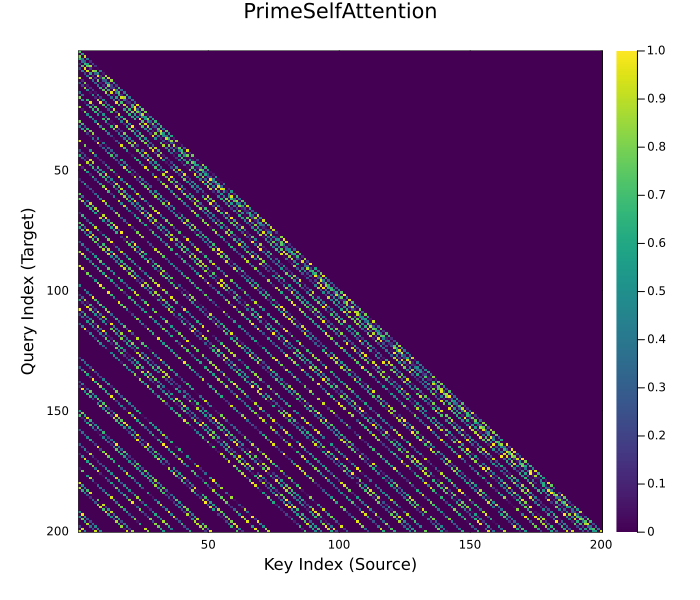

# PrimeAttention.jl

A sparse, number-theoretic attention mechanism that can be used with [Flux.jl](https://fluxml.ai/Flux.jl/stable/).



## Overview

**PrimeAttention** is a sparse attention layer designed for sequence modeling in Flux.jl, works best with Julia 1.12 or later. It introduces a novel connectivity pattern based on the distribution of prime numbers to efficiently handle long contexts without the $O(N^2)$ computational complexity of standard Transformers.

Inspired by architectures like **[BigBird](https://arxiv.org/abs/2007.14062)**, this package implements a hybrid "PrimeBird" mechanism that combines three strategies:
1.  **Global Tokens:** For sequence-wide context summaries.
2.  **Sliding Window:** For local syntax and immediate context.
3.  **Prime Intervals:** For sparse, non-repeating long-range dependencies.

## Usage

`PrimeSelfAttention` is designed to be a drop-in replacement for standard Flux layers. You can drop it directly into a Flux.Chain alongside standard layers like Dense, LayerNorm, or Dropout to build sparse Transformer blocks. Here is a very simple example.

```julia
using Flux
using PrimeAttention

# Define parameters
embed_dim = 64
n_heads = 4
global_tokens = 2
window_size = 3

# Initialize the layer
attention_layer = PrimeSelfAttention(embed_dim, n_heads, global_tokens, window_size)

# Create dummy input
x = rand(Float32, embed_dim, 128, 8)

# Forward pass
y = attention_layer(x)

println("Input:  ", size(x))
println("Output: ", size(y))

# Inside a Flux Chain
model = Chain(
    Dense(32 => 64),
    PrimeSelfAttention(64, 4, 2, 3), 
    LayerNorm(64),
    Dense(64 => 10),
    softmax
)
```

### Number-Theoretic Background

According to the Prime Number Theorem, the density of prime numbers decreases as numbers get larger, approximately following $\pi(x) \approx x/\ln x$.

By restricting attention connections to relative distances $p \in \{2, 3, 5, 7, 11, \dots\}$, PrimeAttention achieves a natural **"Fading Attention"** mechanism:
* **High Resolution:** The model retains dense connectivity in the recent past, as small primes are frequent.
* **High Efficiency:** The model utilizes sparse connectivity in the distant past, as large primes are rare.
* **Deterministic Irregularity:** Unlike fixed stride patterns, prime intervals avoid harmonic synchronization, reducing blind spots in the receptive field.

## Architecture

The `PrimeSelfAttention` layer implements a Causal mask defined by the following logic. For a query token $i$ and a key token $j$:

$$
A_{i,j} = 
\begin{cases} 
1 & \text{if } j \leq G & \text{(Global Attention)} \\
1 & \text{if } i - j \leq W & \text{(Local Window)} \\
1 & \text{if } (i - j) \in \mathbb{P} & \text{(Prime Distance)} \\
0 & \text{otherwise}
\end{cases}
$$

Where $G$ is the number of global tokens and $W$ is the window size.

## Theoretical Efficiency

The computational cost scales **$\approx O(N^2 / \ln N)$**.

While not linear, this offers a significant speedup over standard $O(N^2)$ attention because the density of prime numbers decreases logarithmically as the sequence length grows.

| Sequence Length ($N$) | Standard Ops ($N^2/2$) | PrimeBird Ops | Sparsity | Speedup Factor |
| :--- | :--- | :--- | :--- | :--- |
| 256        | 32896           | 8653            | 3.8      x | 73.7     % |
| 1024       | 524800          | 99685           | 5.3      x | 81.0     % |
| 4096       | 8390656         | 1255303         | 6.7      x | 85.0     % | 
| 16384      | 134225920       | 16606689        | 8.1      x | 87.6     % |
| 65536      | 2147516416      | 226697479       | 9.5      x | 89.4     % |

*Note: "Standard Ops" refers to Causal Attention* $N(N+1)/2$. *"PrimeBird Ops" calculated with global=2, window=3.*

### Complexity Derivation
The number of connections for a token at index $i$ is approximately the number of primes less than $i$, denoted as $\pi(i)$. By the Prime Number Theorem, $\pi(i) \approx i / \ln i$.
Summing this over the sequence length $N$,

$$\sum_{i=1}^{N} \pi(i) \approx \int_{2}^{N} \frac{x}{\ln x} dx \approx O\left(\frac{N^2}{\ln N}\right)$$

This makes PrimeAttention faster than standard attention ($N^2$), but heavier than fixed-window linear attention ($N$).

## Implementation Notes

PrimeAttention.jl implements a custom sparse kernel (`src/kernel.jl`) that iterates exclusively over valid indices, ensuring that memory usage remain proportional to the number of active connections.

To ensure the custom kernel remains compatible with Flux's automatic differentiation engine (`Zygote`), this package uses `Zygote.Buffer` to handle array mutations during the forward pass. 

* Advantage: Pure Julia implementation, differentiable, mathematical background.
* Trade-off: There is overhead during the backward pass compared to optimized CUDA kernels. **This implementation only serves as a reference for research and prototyping**. Production-scale training on large datasets would benefit from a custom CUDA adjoint.